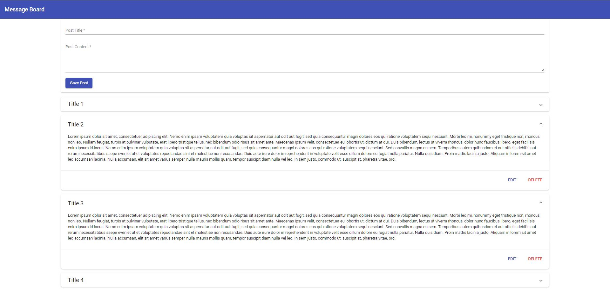

# Angular App

## Application background

An application where user can create the post, can read the post of others, edit their posts and so on

## Project structure

~~~powershell
App
 |
 +---Header
 |	   |
 |	   +----header.component.ts
 |	   +----header.component.html
 +---Posts
 |	   |
 |	   +----post-create
 |	   |	    |
 |	   |	    +---post-create.component.ts
 |	   |	    +---post-create.component.html
 |	   |	    +---post-create.component.css
 |	   +----post-list
 |	   |		|
 |	   |		+---post-list.component.ts
 |	   |		+---post-list.component.html
 |	   |		+---post-list.component.css
 |	   +----post-model.ts
 |	   +----post-service.ts
 +---app.component.html
 +---app.component.ts
 +---app.component.css 
~~~

## Posts : Post Create Component

1. An Angular template driven form implementation.
2.  which takes **POST TITLE** and **POST DESCRIPTION** from the user.
3. Upon clicking the SUBMIT BUTTON, **addPost** method of service executed

## Posts : Post List Component

1. Renders the list of post submitted by the post create component
2. Can expand or collapse by user
3. Collapse : only post title is visible
4. Expand : post title and description is visible
5. The posts arrives to this component from the service
6. List get updated in this component using the subscription

## Posts : Post Model

1. Exports the Post model as an interface
2. Post model consist of title and content

## Posts : Post Service

1. **getPosts()** : Returns the array of posts
2. **addPosts()** : Take the post data as parameter and push it into posts array
3. **getPostUpdateListener()** : return the observable about update in posts array

